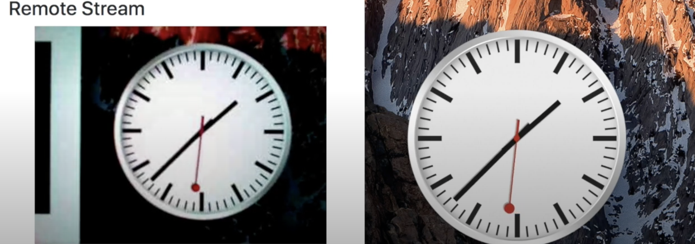
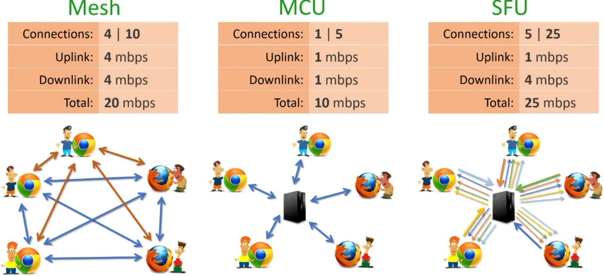
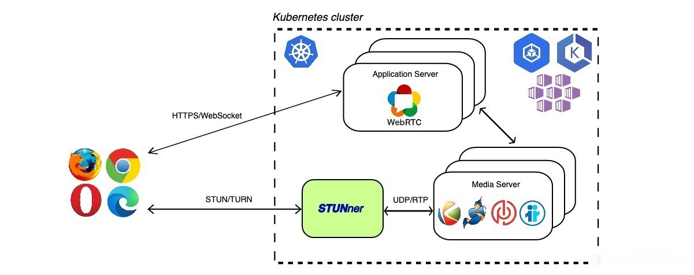

# 遥操作服务设计方案

## 1. 简介
作为一种控制远程机器人运动的远程控制技术，本服务面向移动机器人提供一种通用、简易的云服务，操作者可以通过该服务方便的对远端的机器人进行控制，采集远端机器人的状态信息，实现对远程机器人的控制，包括移动、任务执行等。
本文针对该技术方案进行说明，包括架构设计、物理部署、网络设计、技术选型等。

## 2. 用户故事

- 云服务厂商：(e.g., RoboArtisan)
  - 提供开箱即用的遥操作解决方案，助力机器人解决方案提供商快速完成机器人的远程控制
  - 牵引云厂商其他业务在机器人场景落地，赋能机器人实现算力卸载，降低运营成本
- 解决方案提供商：(e.g., ISV)
  - 通过云服务平台一键部署并启停遥操作服务
  - 通过云服务平台一键更新机器人订阅技能
  - 兼容多摄像头的视觉方案，以及云原生架构满足各种异构机器人
- 机器人操作者：(e.g., EMSD)
  - 通过遥操作服务随时随地控制机器人运动，包括移动、执行机器人订阅的技能等
  - 通过遥操作服务查看机器人状态（电量、信号）和地图信息
  - 通过遥操作服务调整移动速度
  - 通过遥操作服务查看多视角音画，下发语音广播（须具备广播设备）
  - 通过遥操作服务开关视角音画呈现

## 3. 关键竞争力

- 依托云服务厂商高可用的商用服务（RTC、RTSP、OBS、VPN等）和基础设施（GPU、x86）提供98%以上可靠性服务，保障遥操作在复杂多变的环境下遥操作的稳定性和低时延
- 依托RoboSDK和容器技术屏蔽机器人设备异构问题，满足解决方案规模性复制要求
- 支持双向音频交互，丰富遥操作的对话能力
- 支持动态装载机器人订阅技能列表

## 4. 更新日志

- 音视频解码等资源需求大的计算上移云端进行，降低机器人本体资源压力
- 采用H.264相关标准对视频进行编解码，采用流媒体的传输方式进行视频传输以解决视频数据量大而带来的传输慢的问题

## 5. 后续工作

- 通过RoboSDK对接主流云机器人平台技能市场的接口，满足可配置的技能管理及OTA等能力 （短期）
- KubeEdge/IEF 挂载设备下，通过RoboSDK直接读取传感器（音、视频）设备数据而非ros topic可以降低本体资源压力（待定）
- 机器人端不在使用RTC协议，进而在云中的仿真容器和机器人端局域网上创建一个 VPN 隧道，并通过 iptables 来实现控制器和机器人之间的可达性，进一步确保系统稳定性和降低时延。此外针对部分提供网络的单位，受限于其本身使用代理严格LAN控制出站，浏览器和机器人本体进行RTC直连的方案可能不可用。（中期）
  
  

- 结合DLS和机器学习能力应对遥操作过程信息丢失的情况，通过基于共享策略的行为预测，一方面弥补操作者感官信息的不足，另一方面能够提升机器人本体处理未知控制目标的自主能力 （长期）

## 6. 设计细节

### 6.1. 架构视图

#### 1. 用例视图

   *TBA*

#### 2. 逻辑视图

   | 功能模块 | 职责 | 属性要求 | 关键数据结构 | 实现方式及技术 | 提供接口 | 依赖关系 |
   |-----|-----|-----|-----|-----|-----|-----|
   | - |  - |  - |  - |  - |  - |  - |  - | 

   *TBA*

#### 3. 开发视图

   *TBA*

#### 4. 部署视图

   

   - 遥操作服务为Saas服务，产物为docker镜像，发布到租户swr（商用）/ dockerhub （开源），并通过镜像升级的方式更新版本，由于RoboOMS/RoboSDK暂不支持自动更新，操作由最终用户手动触发。
   - 基于KubeEdge/IEF组件对容器进行部署。
   - 受限于RTC通信，部分组件不支持多活容灾，参见[下文](#62-技术选型) .

#### 5. 运行视图

   

### 6.2. 技术选型

1. WebRTC媒体服务
   
   WebRTC 媒体服务主要有三种网络架构：Mesh、MCU、SFU。
   

   | 架构  | 优点             | 缺点             | 代表技术        |
   |------|-----------------|-----------------|-----------------|
   |Mesh  | P2P传输，去中心化，成本低，对云依赖小，通讯质量有一定的保障     |占用大量带宽，占用客户端资源，对本体处理器算力资源有要求 | WebRTC原生 |
   |MCU   | 带宽占用最小，客户端解码压力小    |中心化混流，对云端服务器算力资源压力最大，多路直播下成本最高| Licode、selkies-gstreamer * |
   |SFU   | 服务器压力适中，带宽占用适中             | 客户端解码压力大，对云端服务器算力资源有一定要求 | SparkRTC（商用）* 、Kurento（开源）* |

    考虑到云服务下推荐**解决方案提供商**选用支撑many2many的SFU技术，推荐单机园区场景的**机器人操作者**选用many2one的MCU技术。

    [更多](https://github.com/acgist/taoyao)

2. stun/turn 信令服务
   
   

   当使用 WebRTC 穿越 NAT 时，需要知道浏览器和 机器人本体可以从互联网端到达的公共 IP 和端口，所以需要一个STUN 服务器用于此目的。

    - 公共信令服务：​stun​​​.l.google.com:19302、
stun.ideasip.com:3478 （无需额外服务资源，启动时间长，不支持私有网络）
    - 自建信令服务：coturn （基于成本考虑，除非遥操作服务提供独立的公共服务对所有订阅者开放，媒体服务、信令服务、以及中介服务需要运行在一个pod内，注意其实并不利于资源在线扩展）

3. 控制端

   WebRTC支持所有主流浏览器，通过**nodejs**构建WebRTC Client提供webUI，结合**nginx**反向代理可以轻易完成。

   > 作为云服务，用户在订阅遥操作技能后应当可以直接在管理面进入搭载控制端环境的容器进行操作

4. 数据压缩

    - [ ] 机器人的摄像头将以h.264格式传输视频。由于h.264压缩后数据对比MJPEG节省80%的码率，即使在极端网络下依然能保障实时的第一视角。

    - [ ] 机器人的摄像头将以MJPEG格式传输视频。由于MJPEG不在时间轴方向进行压缩，即使是CPU和内存有限的机器人也可以毫不延迟地进行压缩。

### 6.3. 能力依赖

该方案使用与具备移动能力的机器人，应该具备如下要求：

- [KubeEdge][kubeedge] v1.8+ along with **[EdgeMesh][edgemesh]** running
- 本体至少一个可以被获取数据的摄像头
- 本体 &gt; 1U2G 计算单元 
- 云端 &gt; 4U8G/GPU 计算单元 (GPU 尤佳)

[kubeedge]:https://github.com/kubeedge/kubeedge
[edgemesh]:https://github.com/kubeedge/edgemesh